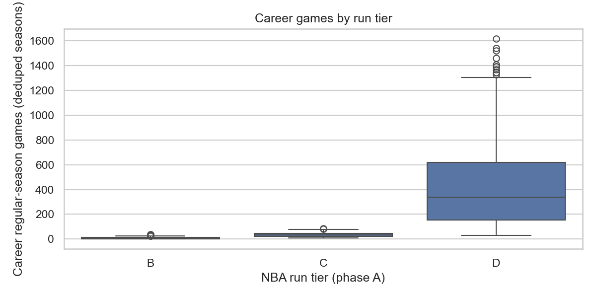
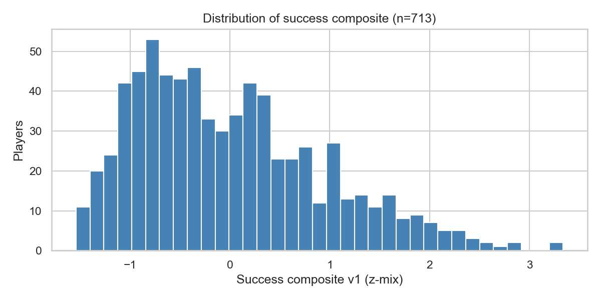
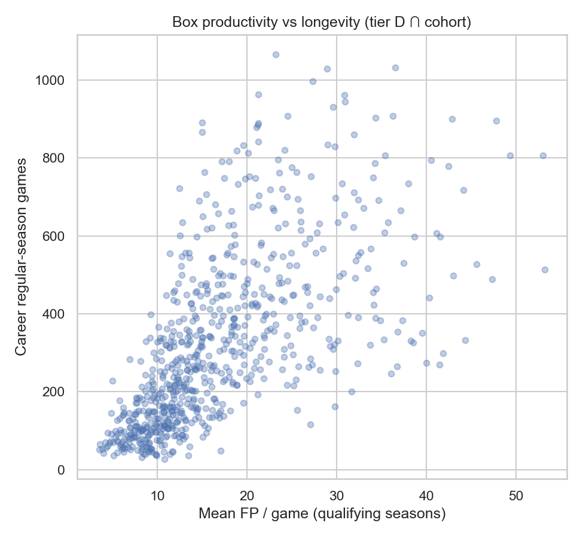
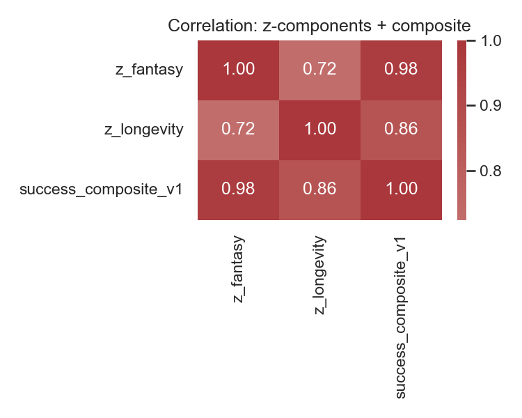
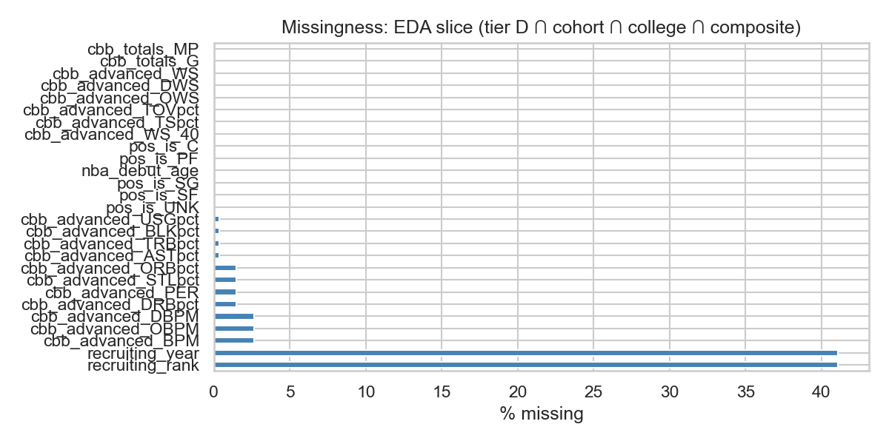
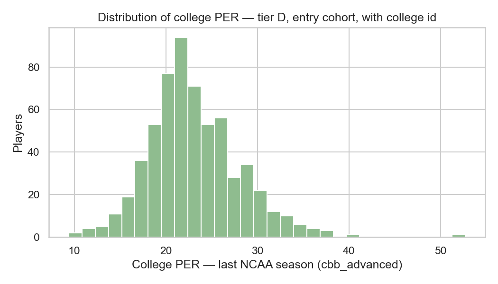
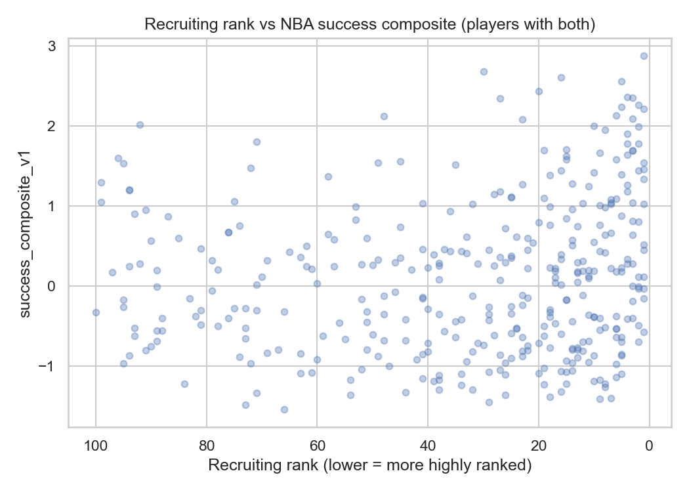
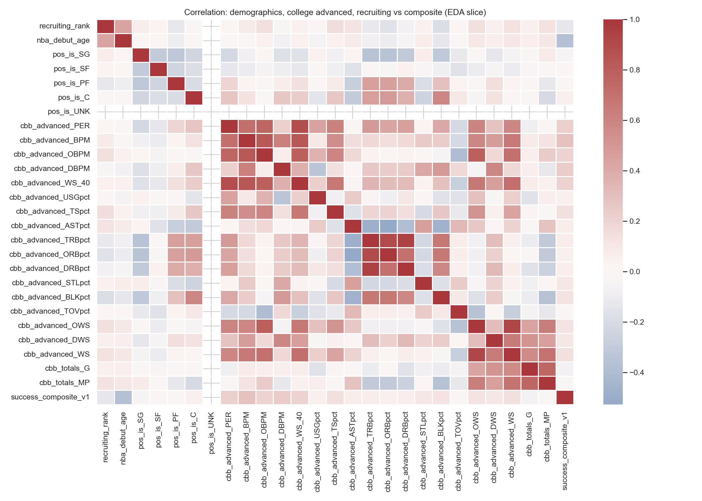

# Deliverable 2: Data and EDA

**STAT 486 — NBA success from college and pre-draft data**

This is my Data and EDA write-up: what I built, what I measured, plots I made, and what was hard. Full outcome rules are in `progress/target_variable_spec.md`. I did the work in `notebooks/02_eda_outcomes.ipynb`, `notebooks/02_eda_college.ipynb`, and `src/analysis/career_outcomes.py`.

---

## 1) Research question and dataset overview

**Research question.** Can I predict NBA career success for college-route players using college stats and pre-draft information, and which pre-draft inputs matter most? (I stated this in `progress/01_proposal.md`.)

**What I built.** I scraped **Basketball-Reference** for NBA season totals and advanced stats and **Sports Reference college** for per-season college tables. I merged them into `data/processed/model_base_player_season.csv`. Each row is one NBA player-season. College `cbb_*` fields use each player's **final (most recent) NCAA season**, not the site **Career** aggregate, and repeat on every NBA season row for that player. I also saved `data/processed/player_career_summary_v1.csv` with one row per NBA player and my outcome fields.

**Credit.** Data come from [Basketball-Reference](https://www.basketball-reference.com/) and [Sports Reference / College Basketball](https://www.sports-reference.com/cbb/). I use them for this class project (not for profit), name the source in the repo, and slow down requests in my scrapers so I am not hammering their servers.

**Legality and ethics.** The sites allow educational and non-commercial use if you credit them; my use is limited to this course and reproduction of my analysis. The tables are public game stats and simple bio fields, not private or sensitive data. I treat results as school work about patterns in the data, not as final judgments about players.

---

## 2) Data description, target variable, and preprocessing

**Outcome I plan to predict later.** I call it `success_composite_v1`. It applies only to players whose **first NBA season** is between **2011–12** and **2022–23** (my **entry cohort**) and who have **tier D**: at least **two** seasons with **G ≥ 10** and **MP ≥ 100** (my **qualifying** seasons). The score is **0.70 × z(mean fantasy points per game in qualifying seasons) + 0.30 × z(log(1 + r))**, where **r** is **career games** divided by **82 ×** the number of seasons from NBA debut through the **latest season in my panel** (opportunity-adjusted longevity). I weight fantasy higher so stars who miss time still score closer to their on-court impact; longevity still nudges the ranking. Fantasy points follow a fixed box-score recipe in `target_variable_spec.md`. Players in tiers **B** and **C** do not get this score; I kept them in the summary for counts and context.

**Inputs (pre-NBA).** Columns starting with `cbb_totals_`, `cbb_per100_`, and `cbb_advanced_` (for example college PER and BPM), plus `recruiting_rank` and `recruiting_year` when they exist. In `02_eda_college.ipynb` I used the subset with tier **D**, entry cohort, a non-null `college_player_id`, and a non-null composite for plots and correlations. **Deliverable 3** (`progress/03_supervised.md`) trains on **`nba_debut_age`**, **rookie NBA position dummies** (`Pos` on earliest season after dedupe), and **college advanced (`cbb_advanced_*`)**—no recruiting—plus a **complete case on `cbb_advanced_BPM`**. See `src/models/training_data.py`. Re-run EDA notebooks only if you change `model_base` or career summary on purpose; if a data pull was interrupted, restore processed CSVs or see `data/README.md` (“Interrupted `run_data_pull`”).

**What I did to clean the data.** (1) For each player-season, I kept one NBA row; when a combined multi-team row (`2TM` / `3TM`) was present, I kept that row so I would not double-count. (2) I marked qualifying seasons using the G and MP rules above. (3) I rolled up to one career row per player, assigned tiers, and computed the composite where the rules apply. (4) College stats on `model_base` are keyed by `college_player_id` and taken from the **last college season** in the scrape. Recruiting fields were often missing; I report those gaps in section 3.

---

## 3) Summary statistics and relationships

**Career summary file (`player_career_summary_v1.csv`).** **1,812** players. **Tier counts:** **B = 305**, **C = 237**, **D = 1,270**. (In my extract no one is tier A; everyone has at least one minute recorded as games played.) **1,128** players are in the entry cohort. **713** have a non-null `success_composite_v1` (tier D and cohort).

**Composite (713 players).** Mean is about **0** and standard deviation about **0.91** because of the z-score step. Min about **−1.81**, max about **2.94**.

**College-focused modeling slice (611 players):** tier D, cohort, college id, and non-null composite. College **PER** (last NCAA season on `model_base`): 602 non-null values, mean **21.3**, SD **4.5**, median **20.8**. College **BPM:** 595 non-null, mean **6.9**, SD **2.7**. (Re-run this notebook after changing `model_base` merge logic; counts shift slightly.) **Recruiting rank:** 360 non-null, mean **33.1**, SD **28.1**, median **24.5** (smaller rank means more highly ranked recruit).

**Correlations.** In `02_eda_college.ipynb` I correlated **`nba_debut_age`**, rookie **position dummies**, **college advanced** fields, and (for EDA only) **recruiting_rank** with `success_composite_v1`. **Figure 8** in section 4 shows the heatmap. After **opportunity-adjusting** the longevity leg of the composite (see `target_variable_spec.md` §5), college PER and the composite correlate about **0.24** on the supervised slice—re-run the notebook to refresh plots; useful signal, but not tight enough to predict one player perfectly.

**Takeaway.** The outcome spans a couple of standard deviations on the composite scale. College advanced stats help on average but leave a lot of noise. Recruiting rank is missing for many players; even when it is there, it only partly lines up with my NBA success score.

---

## 4) Visual exploration

The plots below are **included in this report** so a reader does not have to open the notebooks to see them. The same PNG files live in `progress/figures/`. I made the NBA outcome plots in `02_eda_outcomes.ipynb` and the college plots in `02_eda_college.ipynb`.

### NBA outcome figures

#### Figure 1 — Career games by run tier (B / C / D)

**What it shows.** Total NBA games played, split by my run-tier labels (fringe vs one qualifying year vs two or more).

**Why it matters.** It shows how many players had a short NBA career compared with a long one, and which group is large enough to support a stable outcome. Only tier D players get `success_composite_v1`, so this motivates that choice.

#### Figure 2 — Distribution of the success composite

**What it shows.** The distribution of `success_composite_v1` for players who receive it (tier D and entry cohort).

**Why it matters.** This is the **target** I want to predict from college-side data (and I explored recruiting in EDA). The shape tells me how spread out success is and whether the scale is roughly symmetric or skewed.

#### Figure 3 — Mean fantasy points per game vs career games

**What it shows.** Each point is a player: mean fantasy points per game (qualifying seasons) on one axis and career games on the other.

**Why it matters.** My composite mixes **scoring load** and **longevity**. This plot shows how those two ideas show up together in the data before I combine them into one score.

#### Figure 4 — Fantasy z-score vs longevity z-score

**What it shows.** The two z-scored pieces of the composite plotted against each other.

**Why it matters.** Some players are high on both parts; some lean on games played or on per-game production. That matters for interpreting the composite and for thinking about what college stats might predict.

### College and pre-draft figures

#### Figure 5 — Missing data on college and recruiting fields

**What it shows.** How much is missing for key `cbb_*` and recruiting columns in my supervised-style sample (tier D, cohort, college id, non-null composite).

**Why it matters.** I need to know which predictors I can rely on. Recruiting fields are especially incomplete; that is one reason my **supervised models omit recruiting** and use college advanced stats only (`03_supervised.md`).

#### Figure 6 — College PER in the modeling slice

**What it shows.** Distribution of college PER (`cbb_advanced`, final NCAA season) for players in the slice above.

**Why it matters.** PER is a simple summary of college productivity. The spread shows how different these players were in college before we look at NBA outcomes.

#### Figure 7 — Recruiting rank vs success composite

**What it shows.** Recruiting rank (where available) against `success_composite_v1`. Lower rank means a more highly ranked recruit.

**Why it matters.** It checks whether **pre-draft hype** lines up with my NBA success metric (EDA only—I do not use recruiting in my current supervised feature set). There is a lot of scatter, which matches the moderate correlations in section 3.

#### Figure 8 — Correlation heatmap (demographics, college advanced, recruiting vs composite)

**What it shows.** Pairwise correlations between selected college stats and the outcome.

**Why it matters.** It gives a compact view of which college variables move together and which relate most to the composite before I fit models or run PCA.

---

## 5) Challenges and reflection

The hardest part was **scraping**: rate limits, a few bad pages, and many players with **no college URL** (on the order of **~300** in the project notes), so they have no `cbb_*` block. I treated them separately in EDA and only train on players with college data. For **Deliverable 3** I stuck to **college advanced** predictors only and dropped rows missing **college BPM** (see `03_supervised.md`). **Active players** also have careers that are not finished, so games played will grow over time. I do **not** adjust fantasy points for NBA era; the score can mix real skill with league-wide scoring trends. I write that down instead of changing the v1 rule for this deliverable.

---

## Limitations (for later modeling)

**Era.** Fantasy points per game use raw stats. The NBA scoring environment changes over time, so the outcome is not “era-neutral.”

**Tier D only.** Models fit on `success_composite_v1` only learn from players who reached **two** qualifying seasons. A low prediction does **not** mean “will wash out” unless I add a separate model for that. Details are in `target_variable_spec.md`.

**Other.** The composite is a teaching and analysis choice, not a claim about “true” player value. Some shooting breakdown columns are not filled in `model_base` in my current merge; I can use separate shooting CSVs if I need them. **Supervised v1** does not include recruiting features; PCA (Deliverable 4) may still use a wider pre-draft set.

---

## Submission checklist (Deliverable 2)

- This file: overview, variables, preprocessing, numbers, correlations, **figures embedded in section 4** with relevance text, reflection.  
- Notebooks: `notebooks/02_eda_outcomes.ipynb`, `notebooks/02_eda_college.ipynb`.  
- Figures in `progress/figures/` (re-run notebooks if I change code).  
- Canvas: repo link and note *Deliverable 2 complete* when I submit.

