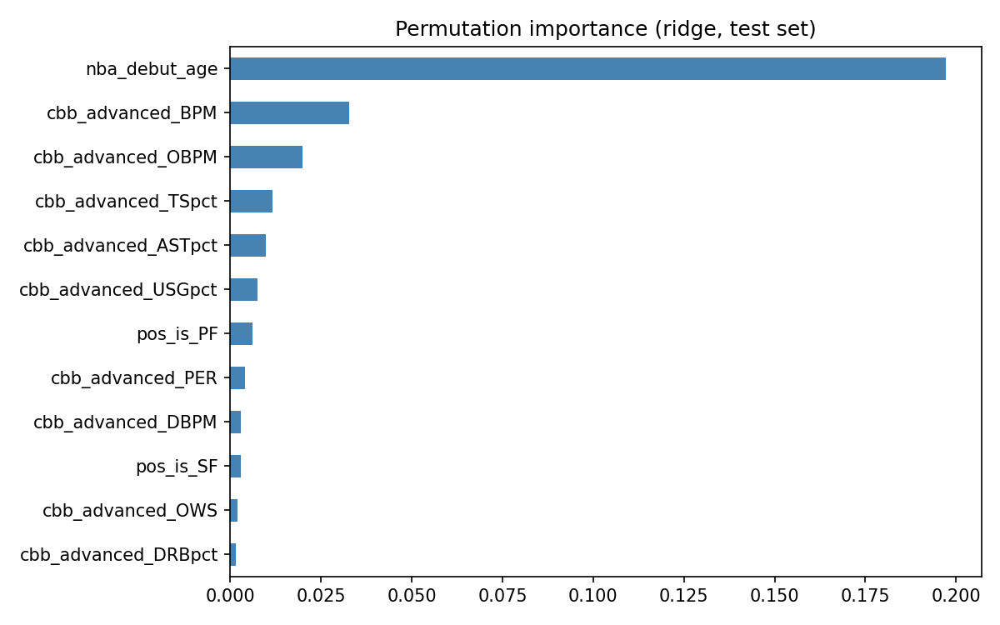

# Deliverable 3: Supervised modeling

**STAT 486: predicting `success_composite_v1` from college and pre-NBA controls**

---

## 1) Problem context and research question

The goal is to predict **`success_composite_v1`** using **last-season `cbb_advanced_*`**, **`nba_debut_age`**, and **rookie position dummies**. The sample is tier **D**, the project entry cohort, players with a **college id**, and a non-null composite. **Recruiting** is not used. For EDA see `progress/02_eda.md`. For variable definitions see `progress/target_variable_spec.md`.

---

## 2) Supervised models implemented

The modeling set has **595** players (**476** train, **119** test) with an **80/20** split and seed **42**. Rows with missing **`cbb_advanced_BPM`** are dropped. College inputs come from each player’s **last NCAA season** on `model_base`. There are **23** predictors: debut age, five **`Pos`** dummies with **PG** as the reference (from the earliest deduped NBA season), and **17** advanced rates. **`cbb_advanced_ORtg`** and **`cbb_advanced_DRtg`** are dropped because they are empty in the merge. **`LassoCV`** keeps **five** nonzero terms on this run: age, BPM, DBPM, steal rate, and turnover rate. Every pipeline uses **`SimpleImputer(median)`**. Linear models also use **`StandardScaler`**. Hyperparameters are tuned with **5-fold cross-validation on the training set** using **RMSE**. Code lives in `src/models/training_data.py`, `src/models/evaluate_supervised.py`, and `notebooks/03_supervised_modeling.ipynb`.

| Model | Tuning | Test RMSE | Test MAE | Test R² |
|--------|--------|-----------|----------|---------|
| Ridge | `GridSearchCV`, `alpha` ×24 (logspace 0.01-1000) | 0.892 | 0.733 | 0.139 |
| LassoCV | built-in 5-fold over α path | 0.885 | 0.725 | 0.152 |
| Random forest | `RandomizedSearchCV`, 24 draws | 0.893 | 0.728 | 0.138 |
| HistGradientBoosting | `RandomizedSearchCV`, 30 draws | 0.900 | 0.734 | 0.124 |

On the test set, **R²** ≈ **0.15** means the model explains about **15%** of the variance in **`success_composite_v1`** (relative to always predicting the test-set mean).

---

## 3) Model comparison and selection

**Lasso** has the best test **RMSE**, **MAE**, and **R²** of the four models. **Ridge** is close behind. The tree models do worse. That pattern fits a modest sample size and a target that is mostly linear in these inputs. **Lasso** is the main model because it performs best and picks a small feature set. **Ridge** is a dense linear baseline. Random forest and gradient boosting are nonlinear checks.

---

## 4) Explainability and interpretability

**Permutation importance** uses **25** repeats on the test set. It reports the average **drop in R²** when one column is shuffled at random. This is not a causal effect. The plot uses **Ridge**, which had the best test **R²** among Ridge, random forest, and gradient boosting. **Lasso** is left out because most coefficients are zero, so permuting unused columns would look unimportant and skew the ranking. **Lasso** still has the best test **R²** when all four models are compared. **Debut age** and **college BPM** rank highest. Other advanced stats add less.

| Rank | Feature | Mean ΔR² (permute) |
|------|---------|-------------------|
| 1 | `nba_debut_age` | 0.198 |
| 2 | `cbb_advanced_BPM` | 0.0328 |
| 3 | `cbb_advanced_OBPM` | 0.0198 |
| 4 | `cbb_advanced_TSpct` | 0.0114 |
| 5 | `cbb_advanced_ASTpct` | 0.00986 |

The full ranking is in `progress/permutation_importance.csv`. The figure is below.



---

## 5) Final takeaways

**R²** near **0.15** shows that pre-NBA stats only weakly predict the composite success score. That is understandable. I would likely be working for an NBA team if I could build a model here with strong predictive power. Teams have studied versions of this problem for years, and every draft still produces busts and steals. The most useful part of the modeling is **which** inputs show up as drivers. **Lasso** keeps a short list of nonzero coefficients. **Ridge** permutation importance ranks all features and spreads credit across correlated advanced stats. Both agree that **debut age** and **college BPM** stand out, with the rest of the advanced block in a supporting role. A stronger model would probably need a bigger data footprint: more or different sources, richer or more granular basketball data, and softer signals such as scouting or medical history, all tied together with a careful missing-data strategy. That kind of expansion is outside the time and scope of this project.

---

## Reproduction

Most people checking this milestone only need the supervised script. It expects `data/processed` and the career summary to already match the repo (see **`README.md`** for a full pipeline from raw data).

```bash
python -m src.models.evaluate_supervised
```

Use `python -m src.data.rebuild_model_base` if you change how college rows merge into `model_base` and need to refresh `data/processed` without a new scrape. Use `python -m src.analysis.career_outcomes` if you change how the target is defined.

This file is **not** auto-generated. After you rerun evaluation, update numbers here so they match the printed JSON or `notebooks/03_supervised_modeling.ipynb`.
